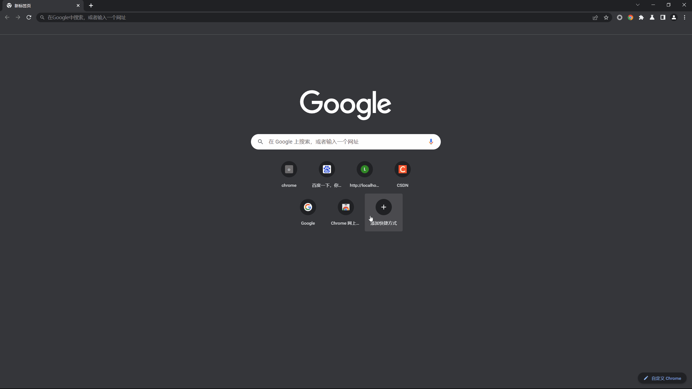
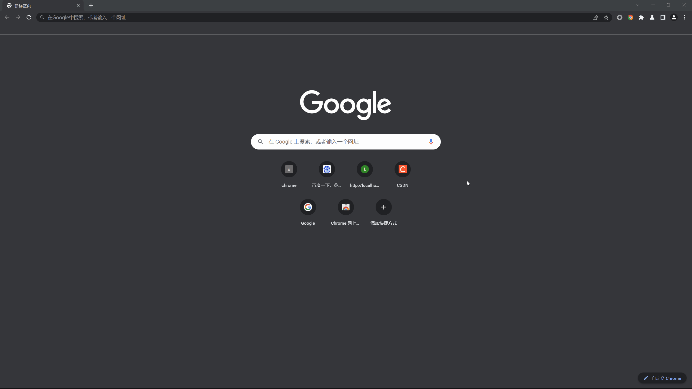

 
  <!--  -->

  <!-- &#xa0; -->

  <!-- <a href="https://opencollectedsite.netlify.app">Demo</a> -->

<h1 align="center">Open Collected Site</h1>

  <a href="./README.md">English</a> &#xa0; | &#xa0; 
  <a href="./README_zh.md">简体中文</a> 
  &#xa0;

  
  
  
  

  <!--  -->

  <!--  -->

  <!--  -->

<!-- Status -->

<!-- <h4 align="center"> 
	🚧  Open Collected Site 🚀 Under construction...  🚧
</h4> 

 -->

  <a href="#about">About</a> &#xa0; | &#xa0; 
  <a href="#features">Features</a> &#xa0; | &#xa0;
  <a href="#technologies">Technologies</a> &#xa0; | &#xa0;
  <a href="#Requirements of Development">Requirements of Development</a> &#xa0; | &#xa0;
  <a href="#starting">Starting</a> &#xa0; | &#xa0;
  <a href="#Later Plan">Later Plan</a> &#xa0; | &#xa0;
  <a href="#license">License</a> &#xa0; | &#xa0;
  <a href="https://github.com/sherlinz0" target="_blank">Author</a>

 

## About

This is a Chrome extension project. The extension is like a favorites which helps you collect and open you favorite sites easily.

## Features

1. main function
    
2. Settings
    

## Technologies

The following tools were used in this project:

- HTML
- CSS
- JavaScript
- Chrome extension

## Requirements of Development
- Environment:
  - Installed a browser with `Chromium` kernel, such as `Chrome`, `Microsoft Edge` and so on.
  - Installed a code editor, such as `Visual Studio Code` and so on.

- Knowledge:
  - Basic knowledge of `HTML`, `CSS` and `JavaScript`.
  - Basic known of `Chrome extension` api.
   
## Starting

1. Clone this project
   
    `git clone https://github.com/sherlinz0/open-collected-site`

2. Installed a browser whose kernel is `Chromium`, such as `Chrome`, `Microsoft Edge` and so on.
3. Installed the extension.
    1. Open the `extensions` manage page.
    2. Set `developer mode` on.
    3. Click `load unpacked`
    4. Select the `src` folder.

## Later plan

Later will develope the followings:
- Search
- Draggle to order
- Classify
- Upgrade the UI, such as supporting `Change Theme`, `Customize Background` and so on. 
- Rich the settings
- ......

## License

This project is under license from GPL-3.0. For more details, see the [LICENSE](LICENSE) file.

Made by <a href="https://github.com/sherlinz0" target="_blank">sherlinz0</a>

&#xa0;

<a href="#top">Back to top</a>
