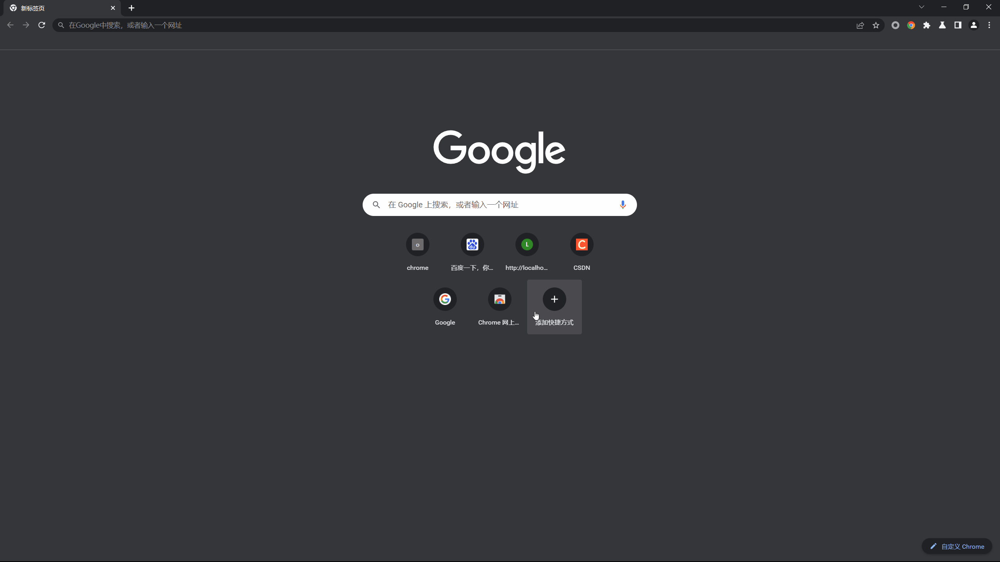
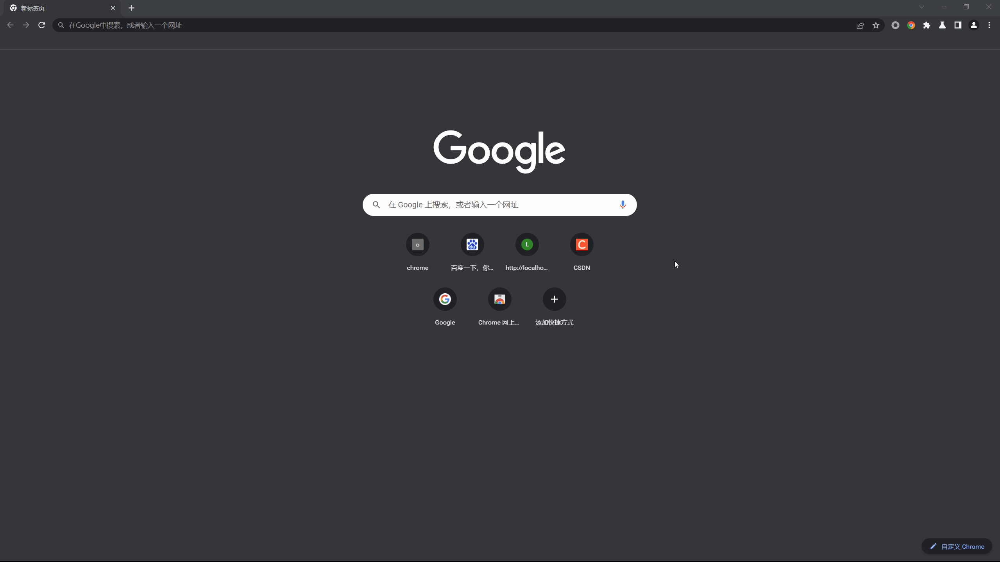

 
  <!--  -->

  <!-- &#xa0; -->

  <!-- <a href="https://opencollectedsite.netlify.app">Demo</a> -->

<h1 align="center">Open Collected Site</h1>

  <a href="./README.md">English</a> &#xa0; | &#xa0; 
  <a href="./README_zh.md">简体中文</a> 
  &#xa0;

  
  
  
  

  <!--  -->

  <!--  -->

  <!--  -->

<!-- Status -->

<!-- <h4 align="center"> 
	🚧  Open Collected Site 🚀 Under construction...  🚧
</h4> 

 -->

  <a href="#about">概述</a> &#xa0; | &#xa0; 
  <a href="#features">特性</a> &#xa0; | &#xa0;
  <a href="#technologies">相关技术</a> &#xa0; | &#xa0;
  <a href="#Requirements of Development">开发前置要求</a> &#xa0; | &#xa0;
  <a href="#starting">尝试</a> &#xa0; | &#xa0;
  <a href="#Later Plan">后续计划</a> &#xa0; | &#xa0;
  <a href="#license">许可证</a> &#xa0; | &#xa0;
  <a href="https://github.com/sherlinz0" target="_blank">作者</a>

 

## 概述

这是一个 Chrome拓展程序 项目. 这个拓展类似于一个收藏夹, 可以使你很方便地收藏以及打开网址.

## 特性

1. 主要功能
    
2. 设置
    

## 相关技术

本项目使用到的相关技术:

- HTML
- CSS
- JavaScript
- Chrome extension

## 开发前置需求
- 环境:
  - 安装内核为 `Chromium` 的浏览器, 如 `Chrome`, `Microsoft Edge` 等.
  - 安装代码编辑器, 如 `Visual Studio Code` 等.

- 知识:
  - 基础 `HTML`, `CSS` 和 `JavaScript` 知识.
  - 基础 `Chrome extension` api 知识.
   

## 尝试

1. 克隆本项目
   
    `git clone https://github.com/sherlinz0/open-collected-site`

2. 安装内核为 `Chromium` 的浏览器, 如 `Chrome`, `Microsoft Edge` 等.
3. 安装本拓展.
    1. 打开拓展管理页面.
    2. 开启 `开发者模式`.
    3. 点击 `加载已解压的拓展程序`
    4. 选择本项目的 `src` 文件夹.

## 后续计划

接下来的开发方向:
- 搜索
- 拖拽排序
- 分类
- 升级 UI 界面, 如支持 `更换主题`, `自定义背景` 等
- 丰富设置选项
- ......

## 许可证

该项目获得GPL-3.0的许可. 有关更多详细信息, 请查看 [LICENSE](LICENSE) 文件.

本 README 由 <a href="https://github.com/sherlinz0" target="_blank">sherlinz0</a> 制作

&#xa0;

<a href="#top">回到顶部</a>
